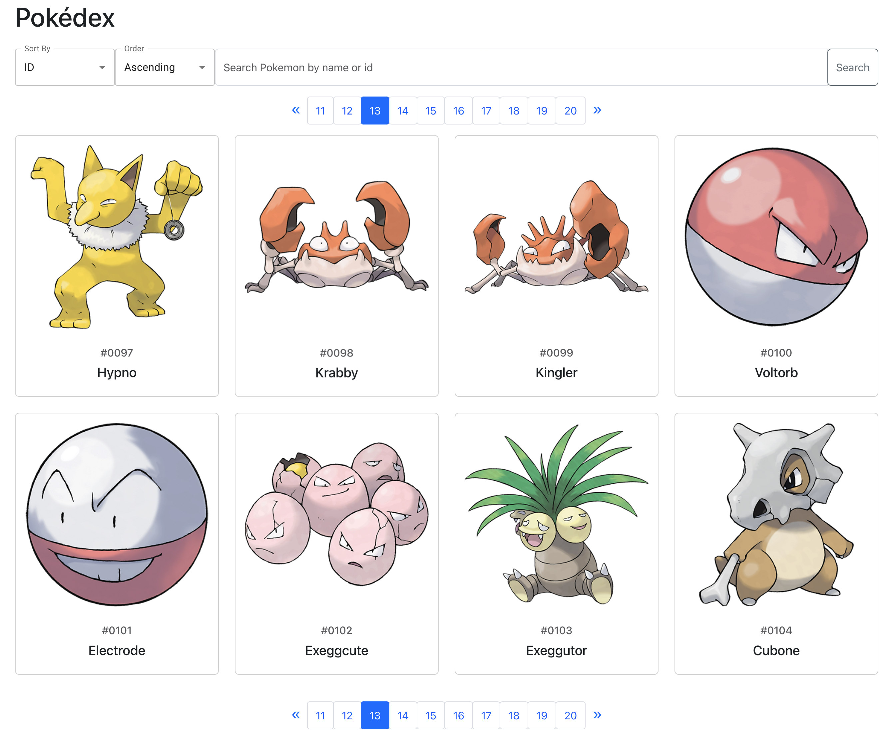

# Pokémon World
If you want to quickly experience the project, please visit my website: [http://13.239.117.149:3001](http://13.239.117.149:3001).

This project is a web-based Pokémon encyclopedia designed to showcase detailed information about various Pokémon. The website allows users to browse a paginated list of Pokémon, view detailed stats, evolutions, and much more. The project is built with a Flask-based backend that provides an API for the React frontend, with SQLite being used to store and serve data retrieved and cleaned from an open-source Pokémon API.


## Table of Contents
- [Tech Stack](#tech-stack)
- [Features](#features)
- [Setup Tutorial](#setup-tutorial)
- [Project Directory Structure](#project-directory-structure)
- [Developer Information](#developer-information)

## Tech Stack

The project is built using the following technologies:

### Backend:
- **Flask**: Flask is used to develop a RESTful API that serves Pokémon data to the frontend. The API allows for listing, searching, sorting, filtering, and retrieving detailed Pokémon information.
- **SQLite**: SQLite is used as the database to store Pokémon data that is fetched and cleaned from an open-source Pokémon API. This lightweight database provides fast and efficient data storage and retrieval.

### Frontend:
- **React**: React is used to build a dynamic and responsive frontend. It interacts with the Flask backend to display Pokémon data.
- **Material-UI (MUI)**: Material-UI is used for building modern, customizable UI components for a better user experience.


## Features

### List Page:
- **Pagination**: The list page supports paginated viewing of Pokémon, with 20 Pokémon displayed per page.
- **Searching**: Users can search Pokémon by ID or name.
- **Sorting**: Users can sort the Pokémon list by:
    - **ID**: Sort by Pokémon ID.
    - **Name**: Sort alphabetically by Pokémon name.
    - **Weight**: Sort by Pokémon weight.
    - **Height**: Sort by Pokémon height.
    - **Sorting Order**: Supports both ascending and descending order sorting for each attribute.

### Detail Page:
- **Navigate Between Pokémon**: Users can use left and right arrows to navigate between Pokémon without returning to the list page.
- **Evolution Chain**: The detail page shows a Pokémon's evolution chain, with clickable images that allow users to navigate to each evolution stage.
- **Details**: The page displays the following Pokémon details:
    - **Category**: Pokémon's category (e.g., "Seed Pokémon").
    - **Type**: The Pokémon's type (e.g., Grass, Fire).
    - **Weaknesses**: A list of types the Pokémon is weak against.
    - **Stats**: Displays key stats such as HP, attack, defense, special attack, special defense, and speed.

## Setup Tutorial

### Backend Setup:
1. **Clone the repository**:
   - Ensure you have installed git in your system, then run the git clone command.
     ```bash
     git clone https://github.com/liyanzhang505/PokemonWorld.git
     ```
2. **Install the Required Dependencies**:
   - Ensure you have Python 3 installed. You'll also need to install the required Python packages: Flask, Flask-CORS, and SQLite3.

   - To install these dependencies, run the following commands:

     ```bash
     pip install flask flask-cors sqlite3

3. **Data Preparation**:
   The Pokémon data is fetched from an open-source API and cleaned before being stored in `pokemon.db`. Follow these steps to process the data:

    - Navigate to the backend directory:

      ```bash
      cd PokemonWorld/backend
      ```

    - Run the following command to fetch and prepare the data:

      ```bash
      python data_prepare.py
      ```

    - This will download and clean the data, then write it into `pokemon.db`. Please be patient as this process may take some time.

4. **Run the Web Service**:
   - Once the data is prepared, you can start the Flask web service by running the following command:

     ```bash
     python app.py
     ```

5. **Test the Web Service**:
   - To verify that the web service is running correctly, open a browser and navigate to the following API endpoint:
     ```bash
     http://localhost:8080/pokemon/list
     ```
    - If the service is working correctly, you should see a JSON response listing the Pokémon.

### Frontend Setup (React):

1. **Install Dependencies**:
    - Navigate to the `frontend` directory:
      ```bash
      cd backend
      ```
    - Install required dependencies using npm
      ```bash
      npm install
      ```
2. **Start the Web Service**:
   - Once the dependencies are installed, start the React development server by running:
     ```bash
     npm start
     ```

3. **Test the Website**:
   - Open a browser and navigate to the following URL to verify that the website is running:
     ```bash
     http://localhost:3001
     ```

## Project Directory Structure
```plaintext
.
├── README.md                       # Project documentation (Introduction, Setup, etc.)
├── backend                         # Backend folder (Flask-based API and data processing logic)
│   ├── app.py                      # Main Flask app for serving API endpoints
│   ├── config.py                   # Configuration settings for Flask, the database, and other environment variables such as `DB_PATH`, `HOST`, and `PORT`. 
│   ├── data_prepare.py             # Script for preparing and processing data to store in the database
│   └── pre_data_process            # Folder for data fetching, saving, and processing utilities
│       ├── __init__.py             # Marks this folder as a Python package
│       ├── fetch_data.py           # Script to fetch data from the open-source Pokémon API
│       ├── save_data.py            # Script to save the cleaned data into the SQLite database
│       └── test.py                 # Test script for validating data or processing logic
├── frontend                        # Frontend folder (React-based user interface)
│   ├── package-lock.json           # Auto-generated: npm's exact version lock for dependencies
│   ├── package.json                # Project metadata and npm dependencies for the frontend
│   ├── public                      # Public folder for static files served by React (partly auto-generated)
│   │   ├── favicon.ico             # Auto-generated: default React favicon
│   │   ├── index.html              # Auto-generated: main HTML file for React app
│   │   ├── logo192.png             # Auto-generated: default React logo (192x192)
│   │   ├── logo512.png             # Auto-generated: default React logo (512x512)
│   │   ├── manifest.json           # Auto-generated: web app manifest for Progressive Web App
│   │   └── robots.txt              # Auto-generated: rules for web crawlers
│   ├── src                         # Source files for the React frontend (partly auto-generated)
│   │   ├── App.css                 # Auto-generated: default styles for the App component
│   │   ├── App.test.tsx            # Auto-generated: basic unit test for the App component
│   │   ├── App.tsx                 # Auto-generated: main React component (customized for your app)
│   │   ├── components              # Custom: folder for React components you created
│   │   │   ├── PokemonDetails.tsx  # Custom: React component for displaying Pokémon details
│   │   │   ├── PokemonList.css     # Custom: CSS for Pokémon list component
│   │   │   └── PokemonList.tsx     # Custom: React component for displaying Pokémon list
│   │   ├── index.css               # Auto-generated: default global CSS file
│   │   ├── index.tsx               # Auto-generated: React entry file (renders App component)
│   │   ├── logo.svg                # Auto-generated: default React logo (SVG format)
│   │   ├── react-app-env.d.ts      # Auto-generated: TypeScript environment definition for React
│   │   ├── reportWebVitals.ts      # Auto-generated: performance measurement for the React app
│   │   ├── setupTests.ts           # Auto-generated: setup for running tests in Jest
│   │   └── types.ts                # Custom: TypeScript types and interfaces used across the app
│   └── tsconfig.json               # Auto-generated: TypeScript configuration file for the React app
└── readme_show.png                 # Custom: Screenshot used in the README.md file
```

## Developer Information
- **Name**: [Callum Li]
- **Email**: [callumli987@gmail.com]
   

